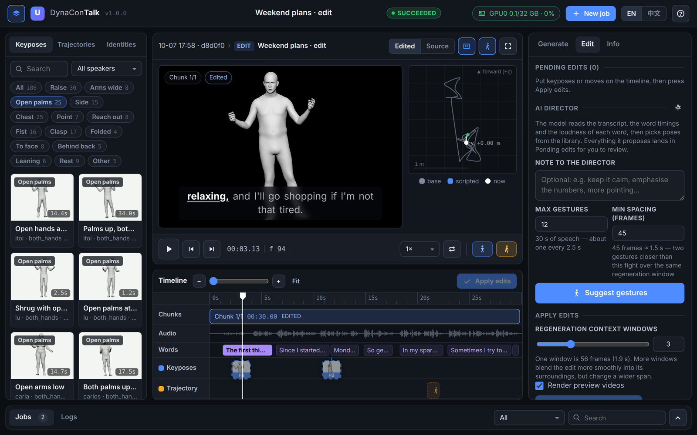
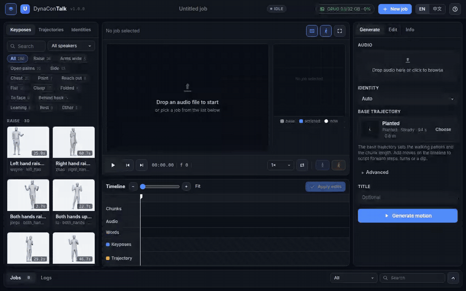
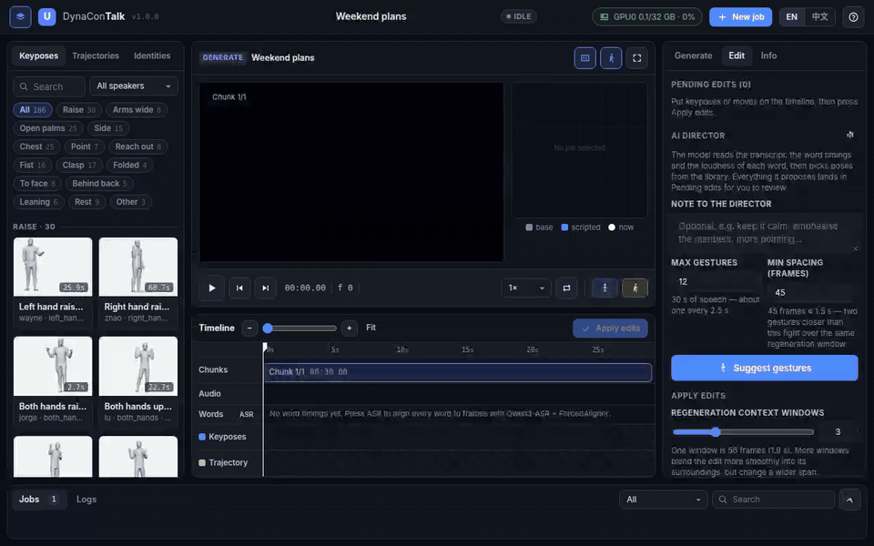
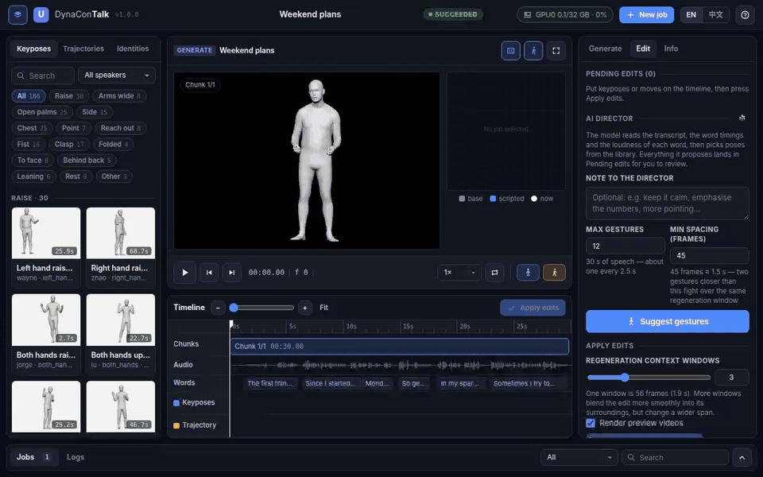
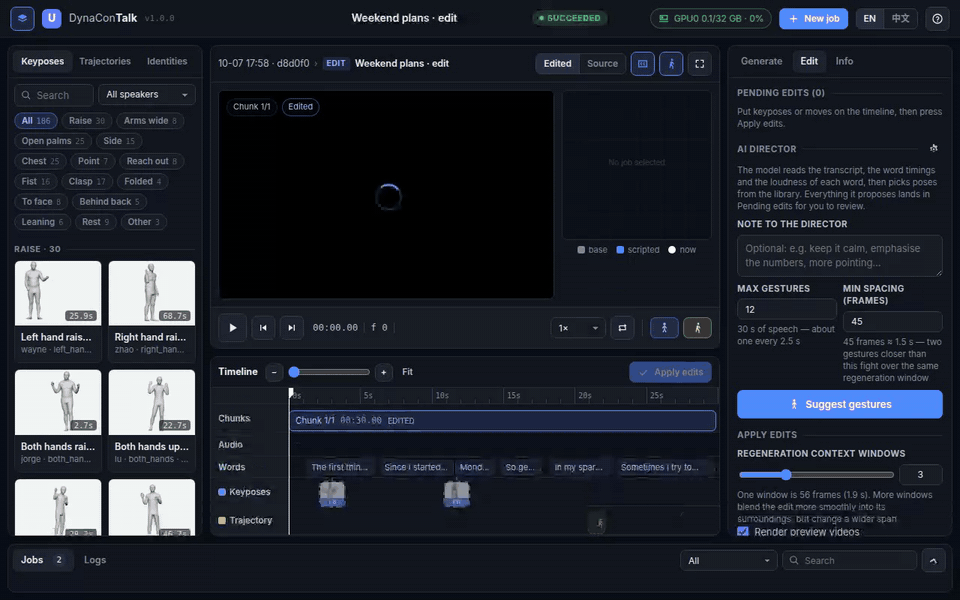
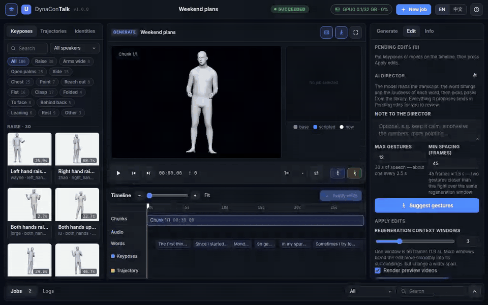

# DynaConTalk

**DynaConTalk: Wavelet-Constrained Diffusion for Long-Form and Controllable Holistic Co-Speech 3D Motion**

[Project page](https://zhuyifeiabcd1.github.io/DynaConTalk/) · Paper (arXiv, coming soon) · [Checkpoints](https://huggingface.co/HAJIMIMANBO1/DynaConTalk)

<p align="center"></p>

This repository holds the training and evaluation code of the DynaConTalk models,
DynaConTalk Studio, a web UI that generates and edits speech-driven body and face motion
with the released models, and the project page.

## DynaConTalk Studio

```bash
bash start.sh      # first run: sets everything up; then starts the Studio and opens the browser
```

See [One-command start](#one-command-start) for what it installs and its options.

### Generate from speech

Drop in a recording, pick the speaker (body shape and speaking style) and a walking pattern,
and generate. Speech features, transcription and both models run in the background.

<p align="center"></p>

### Watch the result

Body and face motion on the speaker's body. Word timings drive karaoke captions and the words
lane; the path map shows where the character walks.

<p align="center"></p>

### Edit with keyposes and scripted moves

Put the playhead on a word, insert a keypose from the library (<kbd>K</kbd>), or script a root
move such as walking forward or turning on the trajectory lane (<kbd>T</kbd>). Applying the edits
generates only the windows around them again.

<p align="center"></p>

### Compare before and after

Every applied edit becomes a new job; A/B switches between the edited and the source motion.

<p align="center"></p>

### Asset libraries

186 keyposes mined from BEAT2 and sorted by gesture type, 198 recorded walking patterns
grouped by amplitude and rhythm, and the 25 BEAT2 speakers with their body shapes.

<p align="center"></p>

## Models

| Recipe | Config | Target | Conditions | Ends at | Released checkpoint |
|---|---|---|---|---|---|
| Editable | `configs/dynacontalk_edit.yaml` | body | speech + keypose + root trajectory + body shape + speaker | epoch 176 | epoch 176 |
| Speech-only | `configs/dynacontalk_speech.yaml` | body | speech + body shape + speaker | epoch 157 | epoch 157 |
| Face | `configs/dynacontalk_face.yaml` | face (FLAME expressions) | speech + body shape + speaker | epoch 157 | epoch 150 (lowest `val/FaceMSE`) |

The speech-only body model and the face model are the ones evaluated below; the Studio uses
the editable body model and the face model.

The body recipes reproduce the schedule of the released checkpoints out of the box:
no learning-rate or epoch flags need to be set. The face model uses the speech-only
conditioning and batch recipe with its own learning-rate decay and a network sized for the 400-dim expression target (512x4 trunk, no joint
tokens) and is selected on `val/FaceMSE`.

## Training quick start

```bash
pip install -r requirements.txt
# put SMPLX_NEUTRAL_2020.npz in src/models/emage_evaltools/smplx_models/smplx/  (see "External assets")

export DYNACONTALK_DATA_DIR=/path/to/beat2_all_db6      # see "Data" below
bash scripts/train_edit.sh                               # editable model
bash scripts/train_speech.sh                             # speech-only model
bash scripts/train_face.sh                               # face model
```

Outputs (checkpoints, CSV logs, resolved config) go to
`logs/<task_name>/runs/<timestamp>/`.

## Released checkpoints

The weights and the Studio's asset libraries are on Hugging Face
([HAJIMIMANBO1/DynaConTalk](https://huggingface.co/HAJIMIMANBO1/DynaConTalk)); `start.sh` downloads them, or by hand into the
repository root:

```bash
huggingface-cli download HAJIMIMANBO1/DynaConTalk --local-dir .
```

```
checkpoints/
  dynacontalk_edit/     model.ckpt  config.yaml  stats.npz   editable body model
  dynacontalk_speech/   model.ckpt  config.yaml  stats.npz   speech-only body model
  dynacontalk_face/     model.ckpt  config.yaml  stats.npz   face model
  trajectory_bigru/     model.ckpt                           root translation from body pose (Studio)
assets/
  keyposes/  trajectories/  identities/  seed.npz            Studio libraries
```

`model.ckpt` holds the EMA weights (`torch.load(..., weights_only=True)` reads it),
`config.yaml` the training recipe the model is built from, and `stats.npz` the normalization
statistics of the training data. The asset libraries were built from BEAT2 test and validation
sequences (186 keyposes, 198 root trajectories, the 25 speakers' body shapes); use them under
the BEAT2 license.

## Conditioning network: DGN v1 / v2

The speech conditioning network is selected with the `dgn` config group:

```bash
bash scripts/train_edit.sh dgn=v2     # default — the released models
bash scripts/train_edit.sh dgn=v1     # the original staged DGN
```

| | `dgn=v1` | `dgn=v2` (default) |
|---|---|---|
| Fusion | staged dynamic gating | semantic base + sparse residual gates |
| Modality-to-depth routing | – | ✓ |
| State-aware gates, attention pooling | – | ✓ |
| Frame-level rhythm path | – | ✓ |
| Noise-level gate schedule | – | ✓ |
| Gate sparsity loss | – | λ = 1e-3 |

Everything else (motion representation, encoder, backbone, losses, schedule) is
identical between the two, so `dgn=v1` vs `dgn=v2` is a controlled comparison.

## Training schedule

Shared by both recipes:

| | |
|---|---|
| Effective batch | 192 (`data.batch_size` × GPUs × `trainer.accumulate_grad_batches`) |
| Optimizer | AdamW, lr 2e-4, weight decay 0 |
| Precision / clipping | bf16-mixed, gradient clip 0.5 |
| EMA | decay 0.995, starting at step 1000 |
| Seed | 42 |
| LR schedule | per-epoch cosine to 5e-6; the cosine period is shortened partway through |

| | Editable | Speech-only | Face |
|---|---|---|---|
| Cosine period | 600 for epochs 0–135, then 200 | 600 for epochs 0–103, then 160 | 600 for epochs 0–32, then 158 |
| `trainer.max_epochs` | 177 | 158 | 158 |

The period switch is `model.lr_scheduler.t_max_schedule` (a list of
`[epoch, T_max]` pairs). The learning rate is evaluated at the absolute epoch, so
it drops at the switch point; this matches the released runs exactly.

The project originally trained for the full 600 epochs with a single cosine decay. When we
checked the code for reproduction, we found that the full 600-epoch run is not only very slow
but also overfits, so the released recipes use the schedule above: it trains faster and gives
better results. To try the original schedule (600 epochs, cosine decay over the whole run):

```bash
bash scripts/train_speech.sh model.lr_scheduler.t_max_schedule=null trainer.max_epochs=600
```

The same two overrides apply to `train_edit.sh` and `train_face.sh`.

### Multiple GPUs

The defaults use one GPU: 24 × 1 × 8 = 192 for the body recipes and 96 × 1 × 2
for the face recipe (the face network is small, so it takes larger steps). With
more GPUs, keep the product at 192, for example:

```bash
bash scripts/train_edit.sh trainer.devices=2 trainer.strategy=ddp_find_unused_parameters_true \
    data.batch_size=48 trainer.accumulate_grad_batches=2
bash scripts/train_face.sh trainer.devices=2 trainer.strategy=ddp_find_unused_parameters_true \
    data.batch_size=96 trainer.accumulate_grad_batches=1
```

Training refuses to start if the product differs from 192, because a different
number of optimizer steps per epoch changes the epoch-based schedule. Set
`expected_effective_batch=null` to train with another batch size deliberately.

## Data

Build the training data from [BEAT2](https://huggingface.co/datasets/H-Liu1997/BEAT2)
(English, all 25 speakers, official train/val/test split):

```bash
python src/tools/preprocess_beat2.py \
    --beat2_root /path/to/BEAT2/beat_english_v2.0.0 \
    --out_dir   /path/to/beat2_all_db6
export DYNACONTALK_DATA_DIR=/path/to/beat2_all_db6
```

It needs a GPU (HuBERT-Large and CLIP ViT-B/32 are downloaded on first use) and
writes:

```
beat2_train.npy  beat2_val.npy  beat2_test.npy
wavelet_mean.npy wavelet_std.npy wavelet_meta.npy
shape_mean.npy   shape_std.npy  shape_betas_mean.npy  shape_betas_std.npy
activity_stats.npy
```

| Feature | Definition |
|---|---|
| Motion | 3-level stationary wavelet transform (db6) of 6D joint rotations, root translation and FLAME expressions, 30 fps |
| Speech, semantic | HuBERT-Large (`facebook/hubert-large-ls960-ft`) last hidden state, resampled 50 → 30 fps |
| Speech, rhythm | amplitude envelope, short-time energy, onsets |
| Speech, mel | 128-band mel power spectrogram |
| Text | CLIP ViT-B/32 embedding of the transcript, per sequence and per 64-frame window |
| Identity | speaker id, first 10 SMPL-X shape coefficients |

Features are extracted in full fp32 (TF32 is switched off: it changes the HuBERT
features noticeably) and stored as float16. Sequences are written in the order of
`data/beat2_sequence_order.json`, which is the order the released models were
trained with; the loader indexes training windows in that order.

## Root-translation BiGRU (Studio)

The body models output joint rotations; the Studio places the generated motion in the scene
with a small BiGRU that predicts the root translation from the body pose
(`src/models/trajectory_bigru.py`). Its input features are the pelvis-centred joint positions
rotated by the root orientation, their velocities and the root yaw rate. It is trained on
its own, on the official BEAT2 train split with the validation split for validation, and its
data are built directly from raw BEAT2 (SMPL-X is needed for the joint positions):

```bash
export DYNACONTALK_TRAJECTORY_DIR=/path/to/trajectory_data
python src/tools/preprocess_trajectory.py --beat2_root /path/to/BEAT2/beat_english_v2.0.0 \
    --out_dir $DYNACONTALK_TRAJECTORY_DIR      # trajectory_train.npy, trajectory_val.npy
bash scripts/train_trajectory.sh
```

The recipe is in `configs/trajectory_bigru.yaml`: whole sequences, batch 64 on one GPU,
AdamW (lr 1e-3, weight decay 1e-4), bf16-mixed, cosine decay over 300 epochs; the three
checkpoints with the lowest `val/loss` and the last one are kept. To use a trained model in
the Studio, export it to the file the Studio loads:

```bash
python src/tools/export_trajectory.py \
    --checkpoint logs/trajectory_bigru/runs/<time>/checkpoints/last.ckpt \
    --out checkpoints/trajectory_bigru/model.ckpt
```

## Evaluation

Two evaluation protocols are provided. Both generate every BEAT2 test sequence end to end
from speech with the sampler settings of the training config (64-frame windows, 8-frame
overlap) and build the model from the training config of the checkpoint (`config.yaml` next
to it, or `<run>/.hydra/config.yaml`) with its weights loaded strictly; they differ in how the
generated motion is scored. Choose the one that matches the results you compare with.

| Protocol | Scripts | Metrics | Test data |
|---|---|---|---|
| [EMAGE](https://github.com/PantoMatrix/PantoMatrix) | `scripts/eval_body.sh`, `scripts/eval_face.sh` | body: FGD, BC, Diversity; face: MSE, LVD | whole test sequences |
| [RAG-Gesture](https://github.com/m-hamza-mughal/RAG-Gesture) | `scripts/eval_rag_gesture.sh` | body: FGD, BeatAlign, L1Div, Diversity | 10 s chunks of the test sequences |

Both use the EMAGE evaluation tools in `src/models/emage_evaltools`.

### EMAGE protocol

The metrics of EMAGE on whole test sequences.

#### Body (speech-only model)

| Metric | EMAGE tool | |
|---|---|---|
| FGD | `FGD` | Fréchet distance between AESKConv features of generated and ground-truth motion |
| BC | `BC` | beat consistency between motion beats and audio onsets |
| Diversity | `L1div` | L1 diversity of joint positions |

```bash
bash scripts/eval_body.sh --checkpoint logs/<task>/runs/<time>/checkpoints/<name>.ckpt \
    --beat2_root /path/to/BEAT2/beat_english_v2.0.0
```

With the released checkpoint: `--checkpoint checkpoints/dynacontalk_speech/model.ckpt`.
Only speech-only checkpoints are accepted: the editable model is also conditioned on
keyposes and a root trajectory, which this evaluation does not provide. No ground-truth
frames are given. FGD is computed on 6D joint rotations; BC and Diversity on SMPL-X joint
positions (neutral body shape). BC reads the BEAT2 audio (`wave16k`) and leaves out the
first and last 2 s of each sequence.

#### Face

| Metric | EMAGE tool | |
|---|---|---|
| MSE | `MSEFace` | mean squared error of the SMPL-X face vertices |
| LVD | `LVDFace` | mean absolute difference of the face vertex velocities |

```bash
bash scripts/eval_face.sh --checkpoint logs/<task>/runs/<time>/checkpoints/<name>.ckpt
```

With the released checkpoint: `--checkpoint checkpoints/dynacontalk_face/model.ckpt`.

The first 8 frames are taken from the ground truth. Vertices are computed by SMPL-X from the
ground-truth jaw pose and body shape with the predicted and ground-truth FLAME expressions.

### RAG-Gesture protocol

The protocol of RAG-Gesture (Mughal et al., CVPR 2025), which evaluates on all 25 BEAT2
speakers with the test sequences cut into 10 s chunks. `src/tools/eval_rag_gesture.py`
follows its evaluation script (`tools/evaluate.py`):

| Metric | |
|---|---|
| FGD | Fréchet distance between AESKConv features of generated and ground-truth chunks (RAG-Gesture calls it FID) |
| BeatAlign | EMAGE `BC` with a velocity threshold of 0.3, leaving out 10 frames at each end of a chunk |
| L1Div | EMAGE `L1div` of joint positions within each chunk |
| Diversity | mean pairwise distance between the joint positions of all chunks, divided by the chunk length (RAG-Gesture tables show it x1000) |

```bash
bash scripts/eval_rag_gesture.sh --checkpoint logs/<task>/runs/<time>/checkpoints/<name>.ckpt \
    --beat2_root /path/to/BEAT2/beat_english_v2.0.0
```

With the released checkpoint: `--checkpoint checkpoints/dynacontalk_speech/model.ckpt`.
As in the EMAGE protocol, only speech-only checkpoints are accepted and every test sequence
is generated whole at 30 fps without ground-truth frames; the motion is then cut into
non-overlapping 300-frame chunks from frame 0 (the number of chunks comes from the whole
seconds of the shorter of audio and motion, a shorter tail is dropped). Joint positions come
from SMPL-X with the neutral body shape and no translation, global orientation included. As
in RAG-Gesture's pipeline, the ground truth is the BEAT2 motion subsampled to 15 fps and
linearly interpolated back to 30 fps (in 6D); `--raw_gt` compares with the original 30 fps
motion instead. BeatAlign, L1Div and Diversity are read against the ground truth (closer is
better), so the script also prints the ground-truth values. It reads the BEAT2 motion and
audio (`smplxflame_30`, `wave16k`).

## Studio: setup and details

Upload a speech recording and get body and face motion with a preview video; then edit it on a
timeline by inserting keyposes and scripting root moves (walk, side-step, turn, crouch, rise,
stand still). An optional LLM assistant proposes keyposes from the transcript. The interface
is in English and Chinese.

### One-command start

```bash
bash start.sh
```

On the first run it sets everything up, then starts the Studio and opens it in the browser;
later runs start in a few seconds. It

1. uses the machine's conda (or installs [Miniforge](https://github.com/conda-forge/miniforge)
   into `.runtime/` when there is none) and creates the environment `dynacontalk` with Python
   3.10, ffmpeg and sox;
2. installs PyTorch built for the NVIDIA driver (CUDA 12.8 / 12.6 / 11.8 wheels, CPU without a
   GPU) and `requirements-webui.txt`;
3. downloads the checkpoints and asset libraries (about 1.8 GB);
4. asks for the SMPL-X model, which cannot be shipped: register at the
   [SMPL-X website](https://smpl-x.is.tue.mpg.de), download `SMPLX_NEUTRAL_2020.npz` and drag it
   (or the zip containing it) into the terminal; files in `~/Downloads` are found automatically;
5. downloads the speech models (HuBERT-Large, CLIP ViT-B/32, Qwen3-ASR-1.7B,
   Qwen3-ForcedAligner-0.6B, about 7 GB), after which the Studio runs offline;
6. checks ffmpeg, the GPU and off-screen OpenGL, starts the server on a free port from 7860
   and opens the browser (on a remote machine it prints the `ssh -L` command to use).

When pypi.org, huggingface.co, download.pytorch.org or conda-forge cannot be reached, it
switches to public mirrors. About 20 GB of disk space are needed in total.

| Option | |
|---|---|
| `--port N` | first port to try (default 7860) |
| `--lan` | accept connections from other machines (there is no login) |
| `--no-browser` | do not open a browser |
| `--smplx PATH` | SMPL-X model file or zip, without the prompt |
| `--checkpoints-from DIR` | copy `checkpoints/` and `assets/` from a local folder instead of downloading |
| `--skip-prefetch` | download the speech models on first use instead |
| `--reinstall` | install the Python packages and models again |
| `--setup-only` | set up, do not start |
| `DYNACONTALK_ENV=name` | conda environment name (default `dynacontalk`) |

Supported: Linux with an NVIDIA GPU (about 6 GB of GPU memory; CPU-only works but takes many
minutes). On Windows, run it inside WSL2; the browser opens on the Windows side. Without
off-screen OpenGL (EGL, or OSMesa with `PYOPENGL_PLATFORM=osmesa`) the motion is generated but
no preview videos are rendered.

### Manual start

With the packages of `requirements-webui.txt`, the released checkpoints and assets (above),
the SMPL-X model (External assets) and ffmpeg:

```bash
uvicorn webui.app:app --host 127.0.0.1 --port 7860      # then open http://127.0.0.1:7860
```

**Generation.** The audio is converted to 16 kHz and its speech features are extracted as for
the training data. Qwen3-ASR transcribes it (CLIP text condition) and Qwen3-ForcedAligner
times every word (shown on the timeline). The audio is cut into chunks as long as the chosen
root trajectory, which restarts in every chunk. In each chunk the editable body model
(speech, root trajectory, body shape, speaker) and the face model (speech, body shape,
speaker) generate the motion window by window (UniPC, 10 steps, guidance 4), both starting
from the first frames of a fixed BEAT2 test sequence (`assets/seed.npz`). The rendered root
translation is predicted from the generated pose by a small BiGRU (`webui/trajectory.py`).
The speaker identity sets the body shape and the speaker embedding; the default trajectory is
the calmest one of the same speaker.

**Editing.** A keypose is blended into the motion around its frame (body part, strength, time
width and wavelet bands are adjustable) and repainted by the editable model: denoising starts
from the half-noised motion, the keypose region is re-noised from the target at every step,
and the target is also given to the network as its keypose condition. A root move rewrites the
trajectory condition and the surrounding windows are generated again. Each edit job builds on
its parent's output, so edits accumulate; the timeline shows the inherited ones.

**AI edit assistant.** In the Edit panel, the assistant sends the transcript, the word
timings, the loudness of each word, the pauses and the keypose catalogue to an LLM and puts its
proposals (keypose and frame) into the pending edits for review. Any OpenAI-compatible
(`https://<host>/v1`) or Anthropic-compatible (`https://<host>`) endpoint works; set the URL,
model and key with the gear button. They are stored in `outputs/studio/agent_config.json`
(mode 0600, never served by the web server).

| Environment variable | |
|---|---|
| `STUDIO_OUTPUT_ROOT` | job folder root (default `outputs/studio`) |
| `STUDIO_ASSET_ROOT` | asset libraries (default `assets`) |
| `STUDIO_GPU` | `CUDA_VISIBLE_DEVICES` of the jobs (default 0) |
| `STUDIO_MIN_FREE_MB` | free GPU memory a job waits for (default 6000; a generation peaks at about 5.3 GB) |
| `STUDIO_PYTHON` | interpreter of the job processes (default: the server's) |
| `STUDIO_AGENT_BASE_URL`, `STUDIO_AGENT_MODEL`, `STUDIO_AGENT_KEY`, `STUDIO_AGENT_PROTOCOL` | assistant defaults |

Every job is a folder `outputs/studio/jobs/<id>/`; `full_bigru.npy` holds the result
(`motion` [T, 268] = axis-angle pose 165, root translation 3, FLAME expression 100, 30 fps) and
`renders/chunks/` the preview videos. The server runs one job at a time as a separate process
(`python -m webui.generate | webui.edit | webui.transcribe --job-dir ... --request-json ...`).

`webui/tests/smoke_ui.py` drives the page in headless Chrome (Playwright) on a finished
generation job and an edit job of it, without starting GPU work:

```bash
python webui/tests/smoke_ui.py http://127.0.0.1:7860 <generation job id> <edit job id>
```

## External assets

### SMPL-X model

The SMPL-X license does not allow redistribution, so the model is not included and the code
never downloads it. Get it yourself:

1. Register at the [SMPL-X website](https://smpl-x.is.tue.mpg.de/) and accept the model
   license.
2. From the download page, get the SMPL-X 2020 neutral model, `SMPLX_NEUTRAL_2020.npz`
   (300 shape and 100 expression components; the model BEAT2 and EMAGE use).
3. Place it at

   ```
   src/models/emage_evaltools/smplx_models/smplx/SMPLX_NEUTRAL_2020.npz
   ```

It is needed for the validation FGD during training (the AESKConv evaluator reads the
skeleton from it), for the evaluations (joint positions, face vertices), for the
root-translation training data (joint positions) and by the Studio (joint positions for the
root translation, preview rendering). Without it, these stop with an error that
points here.

### EMAGE evaluator

`AESKConv_240_100.bin`, the FGD feature extractor of EMAGE, is downloaded automatically into
`src/models/emage_evaltools/` on first use from the EMAGE release on Hugging Face
(`H-Liu1997/EMAGE`).

## Layout

```
index.html, static/         project page (GitHub Pages)
media/studio/              README images
configs/
  dynacontalk_edit.yaml     editable recipe
  dynacontalk_speech.yaml   speech-only recipe
  dynacontalk_face.yaml     face model (speech-only recipe)
  trajectory_bigru.yaml     root-translation BiGRU of the Studio
  dgn/v1.yaml, dgn/v2.yaml  conditioning network switch
  hydra/default.yaml
data/
  beat2_sequence_order.json sequence order of the training data
scripts/                    launch scripts
start.sh                    one-command setup and start of the Studio
requirements-webui.txt      Python packages of the Studio
webui/
  launcher.py               setup steps and server start behind start.sh
  app.py                    Studio web server (FastAPI); static/, templates/: the page
  generate.py, edit.py, transcribe.py   job processes (generation, editing, word timings)
  pipeline.py               model loading, window conditions, job files
  keypose.py, traj_script.py, rotations.py   keypose blending, root-move primitives
  trajectory.py             root translation from the generated pose (BiGRU inference)
  render.py                 preview video (SMPL-X + pyrender)
  agent.py                  LLM edit assistant
src/
  train.py                  entry point
  tools/preprocess_beat2.py builds the training data from raw BEAT2
  tools/preprocess_trajectory.py  builds the root-translation data from raw BEAT2
  tools/export_trajectory.py      exports a trained root-translation BiGRU for the Studio
  tools/eval_body.py        body evaluation, EMAGE protocol (FGD / BC / Diversity)
  tools/eval_face.py        face evaluation, EMAGE protocol (MSE / LVD)
  tools/eval_rag_gesture.py body evaluation, RAG-Gesture protocol (FGD / BeatAlign / L1Div / Diversity)
  tools/eval_common.py      shared model loading and conditioning
  data/beat_smplx_dataset.py  BEAT2 training / validation windows
  data/trajectory_dataset.py  trajectory features and sequences of the root-translation BiGRU
  data/speech_features.py   speech features (rhythm, mel, HuBERT, CLIP text)
  models/light_final.py     diffusion training, validation and window-by-window sampling
  models/nets/light_final.py        denoiser
  models/nets/audio_conditioning.py speech conditioning network (DGN v1 / v2)
  models/wavelet.py         stationary wavelet transform of motion and its inverse
  models/trajectory_bigru.py  root-translation BiGRU and its training
  models/emage_evaltools/   EMAGE evaluation tools (FGD, BC, Diversity, face MSE / LVD)
  utils/                    Hydra / Lightning helpers
```

## Acknowledgements

The training framework was originally derived from
[Light-T2M](https://github.com/qinghuannn/light-t2m) and
[lightning-hydra-template](https://github.com/ashleve/lightning-hydra-template).
The evaluation uses the EMAGE evaluation tools from
[PantoMatrix](https://github.com/PantoMatrix/PantoMatrix) and follows the evaluation
protocols of EMAGE and [RAG-Gesture](https://github.com/m-hamza-mughal/RAG-Gesture); the
speech features follow [SemTalk](https://xiangyuezhang.com/SemTalk/). The Studio transcribes speech with
[Qwen3-ASR](https://huggingface.co/Qwen/Qwen3-ASR-1.7B) and
[Qwen3-ForcedAligner](https://huggingface.co/Qwen/Qwen3-ForcedAligner-0.6B). We thank the
authors for releasing their code and models.

## License

MIT License, see [LICENSE](LICENSE). Code derived from other projects keeps their licenses,
see [THIRD_PARTY_NOTICES.md](THIRD_PARTY_NOTICES.md).

## Project page

`index.html` and `static/` in the repository root are the project page, served by GitHub
Pages at <https://zhuyifeiabcd1.github.io/DynaConTalk/>. Local preview:

```bash
python3 -m http.server 8123      # then open http://127.0.0.1:8123
```
